<picture>
  <source media="(prefers-color-scheme: dark)" srcset="assets/hero-dark.svg">
  <source media="(prefers-color-scheme: light)" srcset="assets/hero-light.svg">
  
</picture>

### `$ whoami`

guitaripod — independent engineer. Six years shipping production iOS, backend, and AI for category-leading consumer products: a multi-billion-dollar wearable health platform, a NASDAQ-listed cybersecurity company, an AI-native health startup. Now building my own — **9 apps live on the App Store** and the open-source stable below.

**[midgarcorp.cc](https://midgarcorp.cc)** · [work with me](https://midgarcorp.cc/services) · [apps](https://midgarcorp.cc/apps) · [blog](https://midgarcorp.cc/archive)

### `$ ls ~/flagship`

| project | what it is |
|---|---|
| [pixie](https://github.com/guitaripod/pixie) | AI image-generation platform — Swift + Kotlin clients, Rust backend on Cloudflare |
| [omnichat](https://github.com/guitaripod/omnichat) ⭐56 | 3rd place, T3 Cloneathon |
| [Swollama](https://github.com/guitaripod/Swollama) ⭐17 | Comprehensive Swift SDK for Ollama |
| [flyr](https://github.com/guitaripod/flyr) ⭐9 | Search Google Flights from the terminal |
| [Weavex](https://github.com/guitaripod/Weavex) ⭐9 | Autonomous research agent powered by local LLMs |
| [unrager](https://github.com/guitaripod/unrager) ⭐4 | A calm Twitter/X TUI with a local-LLM rage filter |
| [wwdc-sessions](https://github.com/guitaripod/wwdc-sessions) | Agent-native knowledge base of every WWDC session since 2014 |

### `$ gh release list --latest`

<!-- Recent Releases -->
| release | lang | ⭐ | what shipped |
|---|---|---|---|
| [songlink-cli 3.2.2](https://github.com/guitaripod/songlink-cli/releases/tag/3.2.2) | Go | 7 | Convert music URLs & download tracks |
| [psybeam 1.0.0](https://github.com/guitaripod/psybeam/releases/tag/1.0.0) | Swift | 1 | Real-time voice-to-voice travel interpreter for iOS |
| [pixie 1.2.0 — mako](https://github.com/guitaripod/pixie/releases/tag/1.2.0) | Swift | 2 | Image Generation Platform |
| [nasa-rs 0.2.0](https://github.com/guitaripod/nasa-rs/releases/tag/0.2.0) | Rust | 2 | Rust SDK for the NASA API |
| [lastfm-rs 0.2.0](https://github.com/guitaripod/lastfm-rs/releases/tag/0.2.0) | Rust | 3 | A blazing-fast Rust SDK for last.fm |
| [unrager 0.18.0](https://github.com/guitaripod/unrager/releases/tag/0.18.0) | Rust | 4 | A calm Twitter/X TUI with a local-LLM rage filter |
| [anvil 0.1.0](https://github.com/guitaripod/anvil/releases/tag/0.1.0) | Swift | 1 | iOS qBittorrent client. UIKit, cross-compiled from Linux to iOS |
| [emusync 0.1.2](https://github.com/guitaripod/emusync/releases/tag/0.1.2) | Rust | 0 | Cross-machine emulation save, mod, and shader cache sync over SSH |
| [flaccy 1.0.0](https://github.com/guitaripod/flaccy/releases/tag/1.0.0) | Swift | 1 | A FLAC music player for iOS with AI-powered library management |
| [flyr 1.6.1](https://github.com/guitaripod/flyr/releases/tag/1.6.1) | Rust | 9 | Search Google Flights from the terminal |
| [Crucible 1.0.0](https://github.com/guitaripod/Crucible/releases/tag/1.0.0) | Swift | 1 | A personal Plex client for iOS, built entirely on Arch Linux. |
| [circadia 1.0.0](https://github.com/guitaripod/circadia/releases/tag/1.0.0) | Rust | 0 | Melanopic-aware color temperature daemon for KDE Plasma Wayland |
| [btop-ios 1.0.0](https://github.com/guitaripod/btop-ios/releases/tag/1.0.0) | Swift | 0 | Terminal-aesthetic system monitor for iOS. |
| [scribe 0.0.1](https://github.com/guitaripod/scribe/releases/tag/0.0.1) | TS | 2 | Local AI-powered grammar checking browser extension |
| [Swollama 3.0.1](https://github.com/guitaripod/Swollama/releases/tag/3.0.1) | Swift | 17 | A comprehensive Swift SDK for Ollama |
| [appofthedead 1.0.1](https://github.com/guitaripod/appofthedead/releases/tag/1.0.1) | Swift | 0 | Learn afterlife beliefs from around the world |
| [Weavex 1.1.0](https://github.com/guitaripod/Weavex/releases/tag/1.1.0) | Rust | 9 | Autonomous research agent powered by local LLMs |
| [emobanana 1.0.1](https://github.com/guitaripod/emobanana/releases/tag/1.0.1) | Rust | 2 | nano banana hackathon submission |
| [minibanana 1.2.2](https://github.com/guitaripod/minibanana/releases/tag/v1.2.2) | TS | 1 | Flash Image 2.5 Preview wrapper web app |
| [image-collage 1.0.0](https://github.com/guitaripod/image-collage/releases/tag/1.0.0) | Rust | 1 | Create 2x2 image collages in the terminal |
<!-- End Recent Releases -->

### `$ cat ~/blog/latest`

<!-- Recent Blog Posts -->
- [App of the Dead: Running Local LLMs on iOS to Teach World Religions](https://midgarcorp.cc/blog/app-of-the-dead-local-llm-afterlife-education/) · Sep 25, 2025
- [Pixie: Building a Production-Ready AI Image Generation Platform with Rust and Native Mobile Apps](https://midgarcorp.cc/blog/pixie-ai-image-generation-platform/) · Sep 22, 2025
- [Control Claude Code Remotely with Zero-Friction SSH Tunnels](https://midgarcorp.cc/blog/claude-code-remote-ssh-tunnel/) · Jul 10, 2025
- [Secure OAuth Implementation Without Local API Keys Using Rust and Cloudflare Workers](https://midgarcorp.cc/blog/oauth-without-local-api-keys-rust-cloudflare-workers/) · Jul 7, 2025
- [Pomme: A Beautiful CLI for App Store Connect That Actually Makes Sense](https://midgarcorp.cc/blog/pomme-beautiful-cli-app-store-connect/) · Jul 2, 2025
- [Making Neovim Follow Your System Theme Automatically](https://midgarcorp.cc/blog/neovim-auto-theme-switching/) · Jul 1, 2025
- [Building a Git-Aware Terminal Prompt That Actually Helps](https://midgarcorp.cc/blog/git-aware-terminal-prompt/) · Jun 24, 2025
- [Integrating Local LLMs into iOS Apps with MLX Swift](https://midgarcorp.cc/blog/integrating-mlx-local-llms-ios-apps/) · Jun 18, 2025
- [Supercharge Your Git Commits with OpenCommit and Ollama](https://midgarcorp.cc/blog/supercharge-git-commits-with-opencommit-and-ollama/) · Jun 12, 2025
- [Adding a Last.fm Now Playing Widget to Your Website](https://midgarcorp.cc/blog/adding-lastfm-now-playing-to-your-website/) · Jun 7, 2025
<!-- End Recent Blog Posts -->

### `$ midgar --stats`

```
┌──────────────────────────────────────────────────────────────────────────────┐
│                              Technologies                                    │
├──────────────────────────────────────────────────────────────────────────────┤
│ Swift      ██████████████████████████████░░░░░░░░░░░░░░░░░░░░  60.4% │
│ Rust       ████████░░░░░░░░░░░░░░░░░░░░░░░░░░░░░░░░░░░░░░░░░░  16.8% │
│ TypeScript ████░░░░░░░░░░░░░░░░░░░░░░░░░░░░░░░░░░░░░░░░░░░░░░   8.2% │
│ Go         ███░░░░░░░░░░░░░░░░░░░░░░░░░░░░░░░░░░░░░░░░░░░░░░░   7.5% │
│ Kotlin     ██░░░░░░░░░░░░░░░░░░░░░░░░░░░░░░░░░░░░░░░░░░░░░░░░   4.1% │
└──────────────────────────────────────────────────────────────────────────────┘
```

### `$ exit 0`

[midgarcorp.cc](https://midgarcorp.cc) · [App Store](https://apps.apple.com/developer/marcus-ziade/id1484270247) · [X](https://x.com/guitaripod) · [Ko-fi](https://ko-fi.com/A0A6EOA7C)


